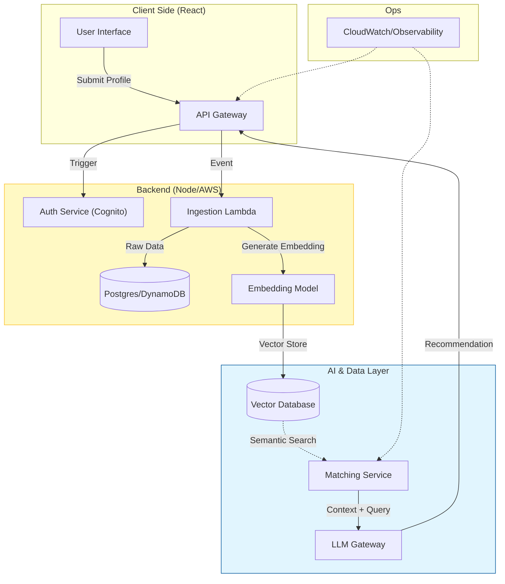
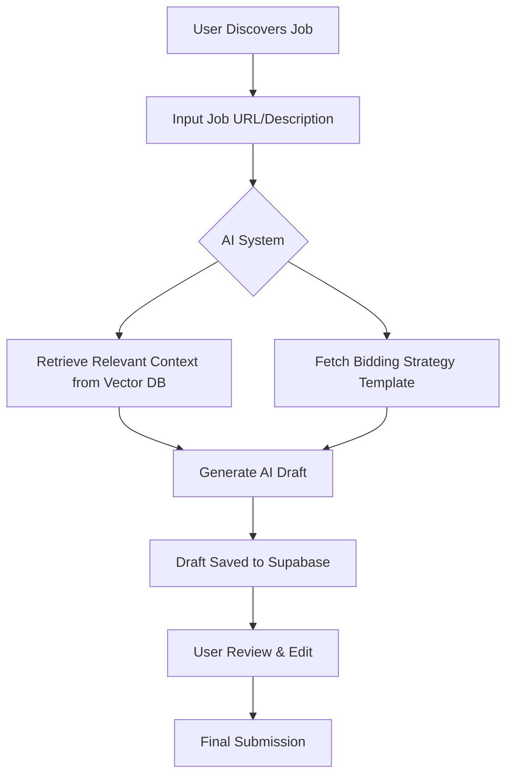

# Auto-Bidder Application Analysis Report

## 1. Executive Summary & Detailed Analysis

The **Auto-Bidder Platform** is a sophisticated full-stack application designed to automate the proposal generation process for freelancers on job boards. It utilizes a **Retrieval-Augmented Generation (RAG)** architecture to synthesize personalized proposals by combining job requirement data with a user's uploaded knowledge base (portfolio, case studies, etc.).

### Technical Architecture

- **Frontend**: Built with **Next.js 15 (App Router)** and **React 19**. It features a modern design system using **TailwindCSS 4** and **shadcn/ui**. Server state management is handled by **TanStack Query**.
- **Backend**: A **Python FastAPI** service. It serves as the "brain," managing AI logic, vector embeddings, and data orchestration.
- **Database**:
  - **Relational**: PostgreSQL (via Supabase) for user sessions, analytical data, and metadata.
  - **Vector**: **ChromaDB** for storing and retrieving document embeddings to support RAG workflows.
- **AI/LLM**: Integrates with **OpenAI (GPT-4-turbo)** for high-quality proposal drafting and **LangChain** for document chunking and retrieval logic.

### Core Logic Analysis

The application follows a modular "Service-Router" pattern in the backend:

- `VectorStoreService`: Manages collection-based document storage, allowing per-user namespacing.
- `DraftManager`: Handles optimistic saving of proposals with versioning and conflict resolution to prevent data loss.
- `SessionManager`: Tracks user interactions and proposal status across different job boards.

---

## 2. Target Objectives & Key Features

### Primary Target

To reduce the time spent on manual proposal writing from **30 minutes to under 2 minutes**, while increasing the quality and relevance of the content through evidence-based AI generation.

### Key Features

| Feature | Description |
| :--- | :--- |
| **Smart Knowledge Base** | Users upload case studies/PDFs/Docx which are indexed into a vector store for context. |
| **AI Proposal Engine** | Generates tailored drafts citing specific past projects relevant to the job post. |
| **Bidding Strategies** | Predefined AI prompt templates for different tones (e.g., casual, corporate, technical). |
| **Draft Versioning** | Built-in conflict resolution for collaborative or multi-device work. |
| **Analytics Dashboard** | Visualizes win rates, time savings, and platform-specific performance. |

---

## 3. Workflows & Diagrams

## Agentic Auto-Bidder

### User Proposal Generation Workflow

### Benefits vs. Limitations

| Benefits | Limitations |
| :--- | :--- |
| **Efficiency**: 90%+ reduction in drafting time. | **Context Window**: Limited by LLM token constraints for very large portfolios. |
| **Consistency**: Maintains brand voice across all bids. | **Scraping Fragility**: Dynamic job boards require frequent scraper updates (Phase 3). |
| **Data-Driven**: Uses RAG to ensure proposals aren't just generic hallucinations. | **Offline Storage**: chromaDB is currently hosted on local/railway persistent disks. |
| **Scalability**: Multi-platform support via unified dashboard. | **Cost**: Dependency on external OpenAI API usage charges. |

---

## 4. Summary & Ranking

### Summary

The Auto-Bidder Platform is a highly structured, enterprise-ready agentic tool. Unlike simple wrappers, it implements a robust data persistence layer and a modular AI service that can be extended with further job board scrapers. The use of Next.js 15 and FastAPI ensures the stack is performant and modern.

### Ranking: ⭐⭐⭐⭐✨ (4.5 / 5)

| Category | Score | Rationale |
| :--- | :--- | :--- |
| **Architecture** | 5/5 | Excellent separation of concerns and modern stack choice. |
| **Feature Set** | 4/5 | Implementation is broad; job discovery (Phase 3) is still in active development. |
| **UI/UX** | 5/5 | Clean, responsive dashboard using top-tier React components. |
| **Innovation** | 4/5 | Strong use of RAG, though dependent on external LLM providers. |

**Final Verdict**: A top-tier technical implementation of a real-world AI utility. Once the automated scraping phase is fully integrated, it will be a market-leading tool for freelance agency automation.
