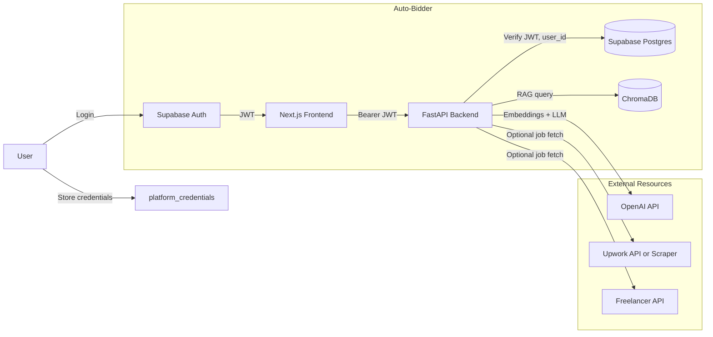

# Auto-Bidder: Production SaaS Outline and What You Need to Start

## 1. App Summary (from docs and codebase)

Auto-Bidder is an **AI-powered proposal platform** for freelancers: RAG (ChromaDB + OpenAI embeddings) + LLM (GPT-4-turbo) to generate personalized proposals from job descriptions and a user knowledge base (PDF/DOCX). Frontend is Next.js 15 + Supabase Auth; backend is Python FastAPI; data in PostgreSQL (Supabase) and ChromaDB.

**Current state:** UI for keywords, strategies, knowledge base, settings, and drafts is in place. Backend has **placeholder auth** (JWT not validated), **no real AI proposal generation** (strategy “test” is a stub), **no job discovery** (Crawlee removed from requirements), and **platform credentials stored in plaintext**.

---

## 2. Outsource Resources Used or Planned for Bidding

| Resource       | Purpose                                                              | Status                                                                                                        | What you need                                                                                                               |
| -------------- | -------------------------------------------------------------------- | ------------------------------------------------------------------------------------------------------------- | --------------------------------------------------------------------------------------------------------------------------- |
| **OpenAI**     | Proposal text (GPT-4-turbo), RAG embeddings (text-embedding-3-small) | In use (embeddings in [vector_store.py](backend/app/services/vector_store.py), LLM only in docs/placeholders) | `OPENAI_API_KEY` (required)                                                                                                 |
| **Supabase**   | Auth (JWT), PostgreSQL, Storage (knowledge-base bucket)              | In use                                                                                                        | `SUPABASE_URL`, `SUPABASE_SERVICE_KEY` (backend); `NEXT_PUBLIC_SUPABASE_URL`, `NEXT_PUBLIC_SUPABASE_ANON_KEY` (frontend)    |
| **Upwork**     | Job discovery (scrape or API), optional bid submit                   | Planned; not implemented                                                                                      | User OAuth tokens or API keys stored per user in `platform_credentials`; Upwork OAuth app (client id/secret) if using OAuth |
| **Freelancer** | Job discovery (RSS/API), optional bid submit                         | Planned; not implemented                                                                                      | User API key in `platform_credentials`; Freelancer API app credentials if required                                          |
| **ChromaDB**   | Vector store for RAG (embeddings)                                    | In use (self-hosted in backend)                                                                               | None; uses `CHROMA_PERSIST_DIR` (e.g. persistent volume on Railway)                                                         |

**Bidding flow (from [ARCHITECTURE_DIAGRAM.md](docs/2-architecture/ARCHITECTURE_DIAGRAM.md)):** Job Discovery (Upwork/Freelancer) → Store projects in Supabase → RAG context from ChromaDB → LLM proposal generation → Human review → Submit via platform API or copy-paste.

---

## 3. What You Need to Start (Checklist)

### 3.1 Required from day one

- **OpenAI API key** – [platform.openai.com](https://platform.openai.com/api-keys). Used for embeddings and proposal generation. Set as `OPENAI_API_KEY` in backend `.env`.
- **Supabase project** – [supabase.com](https://supabase.com). Get:
  - **Project URL** → `SUPABASE_URL` (backend), `NEXT_PUBLIC_SUPABASE_URL` (frontend)
  - **anon (public) key** → `NEXT_PUBLIC_SUPABASE_ANON_KEY` (frontend)
  - **service_role key** → `SUPABASE_SERVICE_KEY` (backend only; never expose in frontend)
- **Login / JWT:** Supabase Auth issues JWTs on sign-in. Frontend already sends `Authorization: Bearer <session.access_token>` ([client.ts](frontend/src/lib/api/client.ts)). Backend must **validate this JWT** and extract `user_id` (sub) instead of using placeholder. No extra “login API key” needed; auth is Supabase JWT.
- **Supabase Storage:** Create a bucket (e.g. `knowledge-base`) for document uploads; configure RLS so users only access their own files.

### 3.2 Optional / later (for real job discovery and submit)

- **Upwork:** For job listing (and optionally submitting bids):
  - **Option A (OAuth):** Create app in Upwork Developer Portal; users connect accounts; you store `access_token` / `refresh_token` in `platform_credentials`. Backend needs Upwork client id/secret only for the OAuth flow (not per-user).
  - **Option B (scraping):** No Upwork keys; Crawlee/scraper only. Higher risk of breakage and ToS issues.
- **Freelancer:** Same idea: user API key or OAuth in `platform_credentials`; app credentials only if you use OAuth.
- **Permission model:** Today the app only needs **your app’s** Supabase and OpenAI keys. Platform-specific API keys / OAuth tokens are **per-user** and stored in `platform_credentials` (must be encrypted at rest for production).

### 3.3 Environment summary

**Backend `.env` (required to run):**

- `OPENAI_API_KEY` – required for RAG + proposals  
- `SUPABASE_URL`, `SUPABASE_SERVICE_KEY` – DB and server-side auth  
- `CHROMA_PERSIST_DIR` – ChromaDB path (default `./chroma_db`)

**Frontend `.env.local`:**

- `NEXT_PUBLIC_SUPABASE_URL`, `NEXT_PUBLIC_SUPABASE_ANON_KEY` – auth and Supabase client  
- `NEXT_PUBLIC_BACKEND_URL` or `PYTHON_AI_SERVICE_URL` – backend base URL (e.g. `http://localhost:8000`)

**No separate “app-level” JWT or “login token”** – only Supabase Auth JWTs from the frontend.

---

## 4. Outline Todolist: Rest to Make It a Real Production SaaS

High-level order of work (details in implementation phase).

### 4.1 Auth and security (must-have for production)

1. **Backend JWT validation** – In all backend routers that use `get_user_id` / `get_user_id_from_token`, verify Supabase JWT (signature, expiry, issuer), then set `user_id = sub`. Remove fallback to a default user. Files: [keywords.py](backend/app/routers/keywords.py), [strategies.py](backend/app/routers/strategies.py), [knowledge_base.py](backend/app/routers/knowledge_base.py), [settings.py](backend/app/routers/settings.py), [session.py](backend/app/routers/session.py), [draft.py](backend/app/routers/draft.py), [analytics.py](backend/app/routers/analytics.py).
2. **Encrypt platform credentials** – Encrypt `api_key`, `access_token`, `refresh_token` (and any secrets) in `platform_credentials` at rest (e.g. Supabase Vault or app-level encryption with a key from env). See [settings_service.py](backend/app/services/settings_service.py) and [003_biddinghub_merge.sql](database/migrations/003_biddinghub_merge.sql).
3. **Supabase Storage** – Create `knowledge-base` bucket; RLS so `auth.uid()` can only read/write own objects. Document in README/QUICKSTART.

### 4.2 Core product: AI proposals

1. **Proposal generation endpoint** – Add e.g. `POST /api/proposals/generate` (or under `/api/drafts` with type proposal). Input: job title, description, skills, budget, strategy_id, user_id (from JWT). Orchestrate: fetch strategy, RAG query ChromaDB by user_id, call OpenAI to generate proposal; return structured draft. Replace placeholder in [strategy_service.test_strategy](backend/app/services/strategy_service.py) with this real pipeline.
2. **Wire frontend to proposal API** – Proposal studio (or existing draft UI) calls the new backend endpoint and saves result to draft_work / bids.
3. **Background document processing** – Move heavy doc processing (parse → chunk → embed → ChromaDB) to background (e.g. Celery/Redis or async task queue) so uploads don’t time out; optional progress via polling or webhooks.

### 4.3 Job discovery (bidding data source)

1. **Crawlee or API-based job discovery** – Re-add Crawlee (or use official APIs) for Upwork/Freelancer; normalize to internal “project” schema and store in Supabase. Run as scheduled or on-demand; respect rate limits.
2. **Platform credential verification** – When user adds Upwork/Freelancer credentials, call platform validation endpoint (e.g. Upwork `/api/profiles/v1/me`, Freelancer as per their docs) and set `last_verified_at` / `verification_error` in `platform_credentials`. See [specs/002-ui-routers-improvement/research.md](specs/002-ui-routers-improvement/research.md).
3. **Projects UI and filters** – List discovered projects; filter by keywords, platform, date; “Generate proposal” from project.

### 4.4 Production hardening

1. **Rate limiting** – Per-user or per-IP limits on proposal generation, uploads, and auth-sensitive endpoints.
2. **File upload safety** – Validate file type (and optionally content); size limits; optional virus scan for production.
3. **Draft cleanup** – Scheduled job (e.g. cron or Vercel cron) to delete or archive old draft_work (see [PRODUCTION_DEPLOYMENT.md](docs/3-guides/PRODUCTION_DEPLOYMENT.md)).
4. **Monitoring** – Sentry (or similar) for backend and frontend; optional APM for latency and errors.
5. **Env and secrets** – No secrets in repo; production envs in Vercel/Railway/Supabase; document required vars in README.

### 4.5 SaaS and scale

1. **Subscription and usage** – Use `user_profiles` / settings (e.g. `proposals_generated`, `proposals_limit`) to enforce tiers; integrate Stripe (or similar) for billing.
2. **E2E and regression** – E2E tests for: signup → upload doc → create strategy → generate proposal → save draft. Backend tests for JWT validation and proposal endpoint.
3. **Docs and runbooks** – Update README, QUICKSTART, and RESTART_GUIDE with production env checklist and “what you need to start” (this section). Add deployment and rollback steps (see PRODUCTION_DEPLOYMENT).

---

## 5. How to Start (Concrete)

1. **Get keys:** Create Supabase project + OpenAI API key. Add them to backend `.env` and frontend `.env.local` as above.
2. **Run locally:** `docker compose up -d postgres chromadb` (if used), `supabase start` and `supabase db reset`, then start backend (uvicorn) and frontend (npm run dev). Confirm health and signup/login.
3. **First production fix:** Implement backend JWT validation and remove placeholder user_id so every request is tied to the real Supabase user.
4. **First value feature:** Implement real RAG + LLM proposal generation behind one endpoint and wire one UI path (e.g. “Generate” from a job) so a user can get a real proposal.
5. **Then:** Storage bucket + credential encryption + job discovery (with what you need from Upwork/Freelancer as above).

---

## 6. Diagram: Bidding Data and Auth Flow

---

## 7. References

- [README.md](README.md) – Stack, quick start, env vars  
- [NEXT_STEPS.md](NEXT_STEPS.md) – Auth, storage, credentials, testing  
- [docs/2-architecture/ARCHITECTURE_DIAGRAM.md](docs/2-architecture/ARCHITECTURE_DIAGRAM.md) – Job discovery, RAG, platform APIs  
- [docs/2-architecture/MASTER_PLAN.md](docs/2-architecture/MASTER_PLAN.md) – Merge plan, platform_credentials, Upwork/Freelancer  
- [docs/3-guides/PRODUCTION_DEPLOYMENT.md](docs/3-guides/PRODUCTION_DEPLOYMENT.md) – Deployment, JWT, monitoring  
- [specs/002-ui-routers-improvement/research.md](specs/002-ui-routers-improvement/research.md) – Platform API verification  
- [database/migrations/003_biddinghub_merge.sql](database/migrations/003_biddinghub_merge.sql) – `platform_credentials` schema

