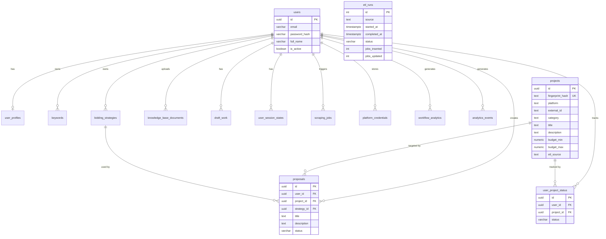
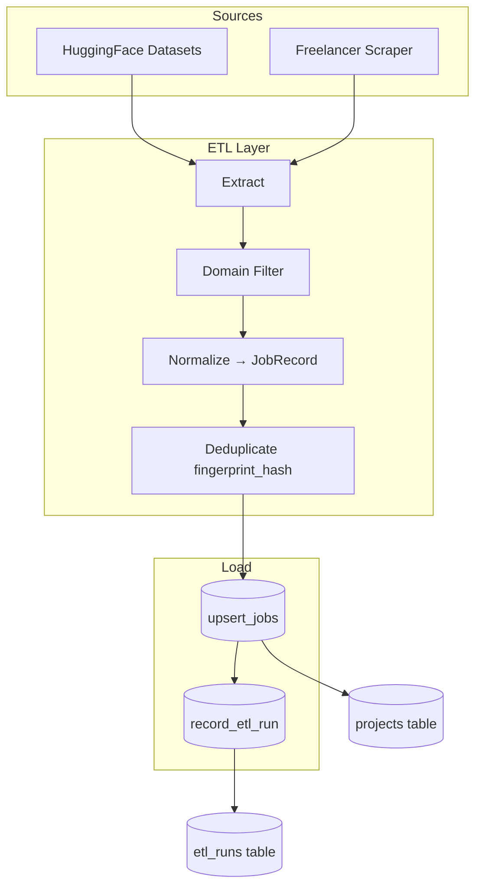
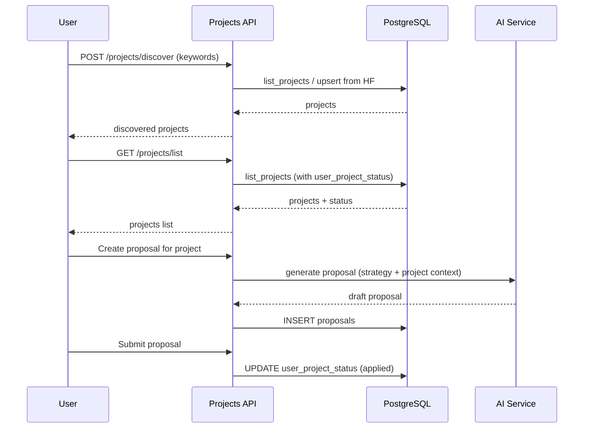
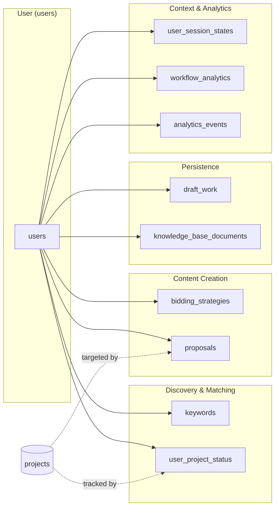
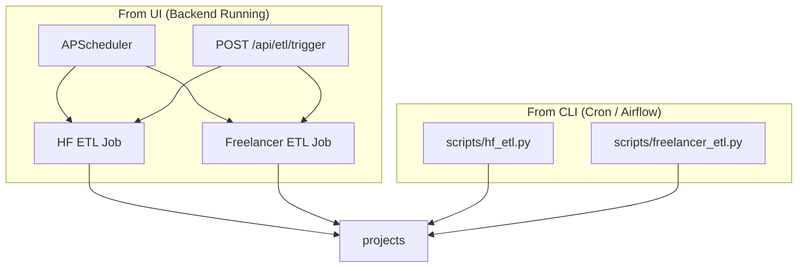

# Auto-Bidder Database Schema Reference

Purpose, relationships, and workflows for all PostgreSQL tables.

---

## 1. Nav-to-Table Mapping

| UI Nav         | Route           | Primary Table(s)              | Group    |
|----------------|-----------------|-------------------------------|----------|
| Dashboard      | /dashboard      | Aggregates (multiple)          | —        |
| Projects       | /projects       | **projects**                   | Resources |
| Proposals      | /proposals      | **proposals**                  | Bidders  |
| Knowledge Base | /knowledge-base | knowledge_base_documents      | Resources |
| Strategies     | /strategies     | bidding_strategies            | Bidders  |
| Keywords       | /keywords       | keywords                      | Resources |
| Analytics      | /analytics      | workflow_analytics, analytics_events | Resources |
| Settings       | /settings       | user_profiles, platform_credentials | Resources |

**Backend-only (no nav)**: etl_runs, user_session_states, draft_work, scraping_jobs, user_project_status, user_project_qualifications

---

## 2. Table Overview

| Table                        | Purpose                                                              |
| ---------------------------- | -------------------------------------------------------------------- |
| **users**                    | User accounts (auth, email, password)                                |
| **user_profiles**            | Extended user data (subscription, preferences, onboarding)           |
| **projects**                 | Job listings from ETL (HuggingFace, Freelancer) — backs Projects nav |
| **user_project_status**      | Per-user pipeline status on projects (reviewed, applied, won, lost)  |
| **etl_runs**                 | ETL pipeline run history (source, counts, status)                    |
| **keywords**                 | User-defined search keywords for job matching                        |
| **bidding_strategies**       | AI proposal generation configs (prompts, tone, temperature)          |
| **proposals**                | User-created proposals for projects — backs Proposals nav            |
| **knowledge_base_documents** | User-uploaded docs for RAG (portfolio, case studies)                 |
| **draft_work**               | Auto-saved drafts (proposals, etc.)                                  |
| **user_session_states**      | Session context (active feature, navigation, filters)                |
| **scraping_jobs**            | Scraping task queue (platform, search terms, status)                 |
| **platform_credentials**     | Stored API keys/tokens for Upwork, Freelancer, etc.                  |
| **workflow_analytics**       | Workflow event metrics (duration, success)                           |
| **analytics_events**         | User behavior events (event_type, event_data)                        |

**Removed (005-refactor)**: jobs (renamed to projects), legacy projects, bids

---

## 3. Entity Relationship Diagram

---

## 3. Core Workflows

### 3.1 ETL Pipeline Flow

### 3.2 Job Discovery & Proposal Flow

### 3.3 User-Centric Data Flow

---

## 4. Table Details

### 4.1 Core Tables

#### `users`
| Column | Type | Purpose |
|--------|------|---------|
| id | uuid | Primary key |
| email | varchar | Login identifier |
| password_hash | varchar | Bcrypt hash |
| full_name | varchar | Display name |
| is_active | boolean | Account enabled |
| is_verified | boolean | Email verified |
| last_login_at | timestamptz | Last login |

**Relationships:** Referenced by all user-scoped tables via `user_id`.

---

#### `projects`
| Column | Type | Purpose |
|--------|------|---------|
| id | uuid | Primary key |
| fingerprint_hash | text | Unique dedup key (platform + external_id) |
| platform | enum | upwork, freelancer, huggingface_dataset, etc. |
| external_id | text | Platform's job ID |
| category | enum | ai_ml, web_development, fullstack_engineering, etc. |
| title | text | Job title |
| description | text | Full description |
| skills_required | text[] | Required skills |
| budget_min, budget_max | numeric | Budget range |
| employer_name | text | Client name |
| etl_source | text | ETL source (hf_loader, freelancer_scheduler, etc.) |
| posted_at | timestamptz | When job was posted |

**Purpose:** Central project catalog (renamed from jobs). Fed by ETL (HF, Freelancer). Projects UI reads from here when `ETL_USE_PERSISTENCE=true`.

---

#### `etl_runs`
| Column | Type | Purpose |
|--------|------|---------|
| id | int | Primary key |
| source | text | hf_etl_script, freelancer_scheduler, etc. |
| started_at, completed_at | timestamptz | Run window |
| status | text | success, failed, running |
| jobs_extracted | int | Raw count before filter |
| jobs_filtered | int | After domain filter |
| jobs_inserted, jobs_updated | int | DB write counts |
| error_message | text | On failure |

**Purpose:** Audit trail for ETL pipeline runs.

---

#### `user_project_status`
| Column | Type | Purpose |
|--------|------|---------|
| user_id | uuid | FK → users |
| project_id | uuid | FK → projects |
| status | varchar | new, reviewed, applied, rejected |

**Purpose:** Per-user status on each project (e.g., "applied" when user submits proposal).

---

### 4.2 Proposal & Bidding Tables

#### `bidding_strategies`
| Column | Type | Purpose |
|--------|------|---------|
| user_id | uuid | FK → users |
| name | varchar | Strategy name |
| system_prompt | text | AI prompt template |
| tone | varchar | Professional, friendly, etc. |
| temperature, max_tokens | numeric/int | LLM params |
| is_default | boolean | Default for user |

**Purpose:** AI proposal generation configs.

---

#### `proposals`
| Column | Type | Purpose |
|--------|------|---------|
| user_id | uuid | FK → users |
| project_id | uuid | FK → projects |
| strategy_id | uuid | FK → bidding_strategies |
| title, description | text | Proposal content |
| status | varchar | draft, sent, won, lost |
| generated_with_ai | boolean | AI-generated flag |

**Purpose:** Proposals created for projects, optionally using a strategy.

---

### 4.3 Supporting Tables

| Table | Purpose |
|-------|---------|
| **keywords** | User search keywords; `jobs_matched`, `last_match_at` for tracking |
| **knowledge_base_documents** | Uploaded docs for RAG; `chroma_collection_name`, `chunk_count` |
| **draft_work** | Auto-saved drafts; `entity_type` + `entity_id` polymorphic |
| **user_session_states** | Session context; `active_feature`, `navigation_history`, `filters` |
| **scraping_jobs** | Scraping tasks; `platform`, `search_terms`, `status` |
| **platform_credentials** | API keys for Upwork, Freelancer; encrypted storage |
| **workflow_analytics** | Workflow events; `event_type`, `duration_ms`, `success` |
| **analytics_events** | User events; `event_type`, `event_data`, `session_id` |

---

## 5. ETL Entry Points

---

## 6. Quick Reference: FK Summary

| Child Table | Parent | FK Column |
|-------------|--------|-----------|
| user_profiles | users | user_id |
| keywords | users | user_id |
| bidding_strategies | users | user_id |
| proposals | users | user_id |
| proposals | projects | project_id |
| proposals | bidding_strategies | strategy_id |
| user_project_status | users | user_id |
| user_project_status | projects | project_id |
| knowledge_base_documents | users | user_id |
| draft_work | users | user_id |
| user_session_states | users | user_id |
| scraping_jobs | users | user_id |
| platform_credentials | users | user_id |
| workflow_analytics | users | user_id |
| analytics_events | users | user_id |

**Removed (005-refactor):** bids, legacy projects. **Note:** projects has no user_id (ETL-sourced).

---

*Generated from Auto-Bidder schema. See `docs/todos/autobidder-etl-rag-schema-spec.md` for full ETL/RAG spec.*
