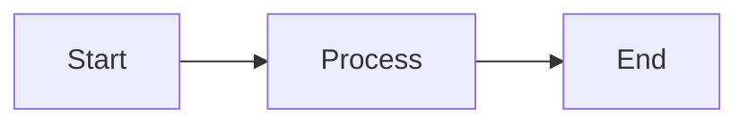

# Technical Diagrams & Documentation

This directory contains technical diagrams and workflow documentation for the Auto Bidder platform.

## 📊 Available Diagrams

### [architecture-diagram.md](./architecture-diagram.md)
**System Architecture Overview**
- Visual representation of the full-stack architecture
- Shows frontend (Next.js), backend (FastAPI), databases (PostgreSQL, ChromaDB)
- External service integrations (OpenAI, web scraping)
- Component relationships and data flow

### [auth-flow-diagram.md](./auth-flow-diagram.md)
**Authentication Flow**
- JWT-based authentication sequence diagram
- Signup, login, and authenticated request flows
- Security features and token structure
- Password hashing and validation

### [workflow-diagram.md](./workflow-diagram.md)
**Proposal Generation Workflow**
- End-to-end proposal generation process (6 stages)
- Input collection → Context gathering → RAG processing → AI generation → Post-processing → Finalization
- Technologies used at each stage
- Key metrics and quality checks

### [quickstart-flow-diagram.md](./quickstart-flow-diagram.md)
**Quick Start Setup Flow**
- Visual guide for project setup
- Docker vs Manual setup paths
- Environment configuration
- Common issues and solutions
- Verification steps

## 🎨 Diagram Format

All diagrams use **Mermaid** - a markdown-based diagramming tool that renders automatically on GitHub.

### Viewing Diagrams

1. **On GitHub**: Just open the `.md` file - diagrams render automatically
2. **VS Code**: Install "Markdown Preview Mermaid Support" extension
3. **Online**: Copy content to [Mermaid Live Editor](https://mermaid.live/)

### Editing Diagrams

Diagrams are defined using Mermaid syntax:



Learn more: [Mermaid Documentation](https://mermaid.js.org/)

## 🔄 Converting to PNG

If you need static PNG images:

```bash
# Install mermaid-cli
npm install -g @mermaid-js/mermaid-cli

# Convert to PNG
mmdc -i architecture-diagram.md -o ../assets/images/architecture-diagram.png -b transparent
```

Or use online tools:
- [Mermaid Live Editor](https://mermaid.live/) - Export as PNG/SVG
- [Mermaid Chart](https://www.mermaidchart.com/) - Professional diagramming

## 📝 Adding New Diagrams

1. Create a new `.md` file in this directory
2. Use Mermaid syntax for diagrams
3. Include text explanations and context
4. Reference from main README or other docs
5. Keep diagrams simple and focused

### Template

```markdown
# Diagram Title

Brief description of what this diagram shows.

## Diagram

\`\`\`mermaid
graph TD
    A[Component A] --> B[Component B]
\`\`\`

## Description

Detailed explanation of components, relationships, and key concepts.

## Related Documentation

Links to related docs or implementation files.
```

## 🔗 Referenced From

These diagrams are referenced from:
- [Main README.md](../../README.md) - Architecture, workflow, auth flow sections
- [architecture-diagram.md](./architecture-diagram.md) - System design
- [setup-and-run.md](../setup-and-run.md) - Setup instructions

## 🛠️ Maintenance

When updating diagrams:
- ✅ Keep diagrams in sync with actual implementation
- ✅ Update text descriptions to match diagram changes
- ✅ Verify diagrams render correctly on GitHub
- ✅ Simplify complex diagrams into multiple smaller ones
- ✅ Use consistent color schemes and styling

## 📚 Resources

- [Mermaid Documentation](https://mermaid.js.org/)
- [Mermaid Diagram Types](https://mermaid.js.org/intro/syntax-reference.html)
- [GitHub Mermaid Support](https://github.blog/2022-02-14-include-diagrams-markdown-files-mermaid/)
- [Mermaid Cheat Sheet](https://jojozhuang.github.io/tutorial/mermaid-cheat-sheet/)

---

**Need to add a diagram?** Create a `.md` file here and use Mermaid syntax!
