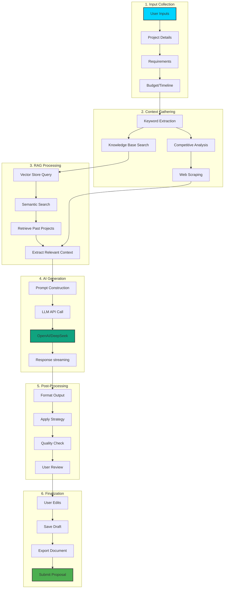

# Proposal Generation Workflow

This diagram illustrates the end-to-end workflow for generating AI-powered proposals.

## Workflow Overview

## Detailed Workflow Stages

### 1. Input Collection
- User provides project title, description, requirements
- Budget range and timeline constraints
- Platform-specific details (Upwork, Freelancer, etc.)

### 2. Context Gathering
- **Keyword Extraction**: Extract relevant technical keywords from requirements
- **Competitive Analysis**: Analyze competing proposals if available
- **Web Scraping**: Gather real-time market data and trends
- **Knowledge Base Search**: Query stored documents for relevant context

### 3. RAG Processing
- Embed user query into vector space
- Perform semantic search across ChromaDB vector store
- Retrieve top-k most relevant past projects (k=5 default)
- Extract context snippets with metadata

### 4. AI Generation
- Construct optimized prompt with:
  - System instructions
  - Retrieved context from RAG
  - User requirements
  - Bidding strategy parameters
- Stream response from OpenAI GPT-4 or DeepSeek
- Handle token limits and chunking

### 5. Post-Processing
- Format markdown output with proper sections
- Apply bidding strategy (conservative/standard/aggressive)
- Quality checks:
  - Word count validation
  - Required sections present
  - Grammar and spelling
- Present to user for review

### 6. Finalization
- User can edit generated content in rich text editor
- Save multiple draft versions
- Export to PDF/DOCX format
- Submit directly to platform (future feature)

## Key Technologies

- **LangChain**: Orchestration framework for LLM chains
- **ChromaDB**: Vector database for semantic similarity search
- **Playwright**: Web scraping for competitive intelligence
- **FastAPI**: Async API with streaming responses
- **React**: Interactive UI with real-time updates
