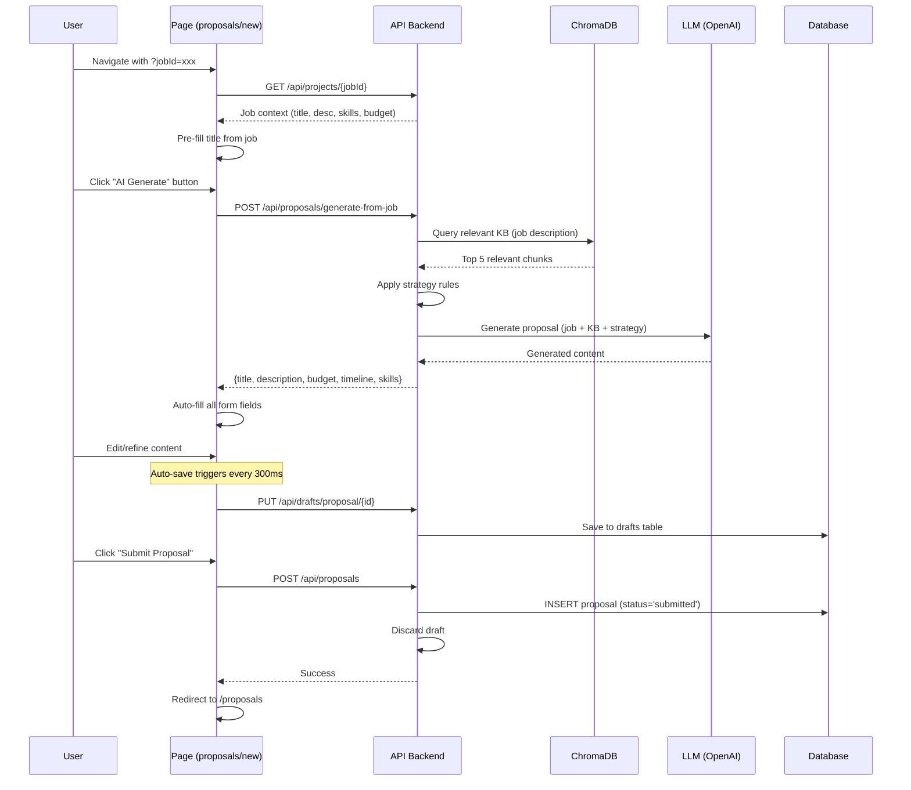
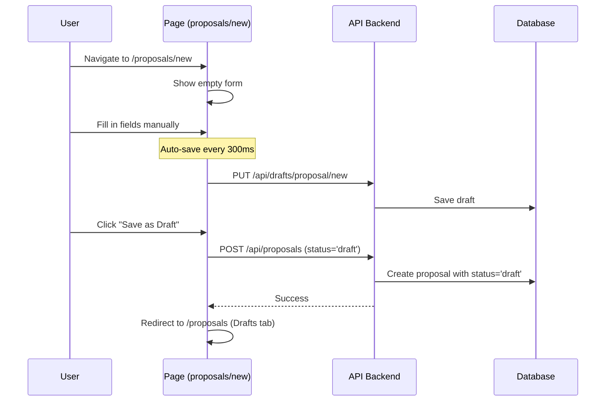
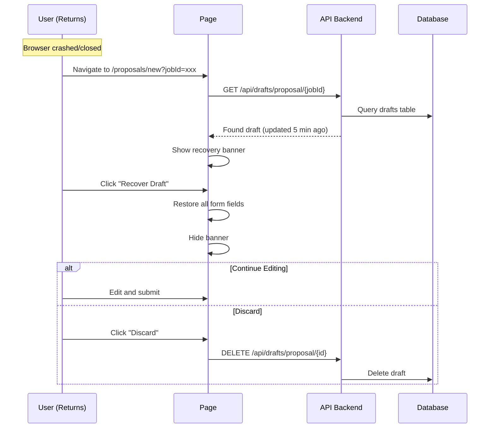

# Proposals Documentation 📝

**Last Updated**: March 8, 2026  
**Status**: ✅ Production Ready

---

## Overview

The Proposals feature is the core workflow of the Auto-Bidder application, enabling users to create, manage, and submit job proposals with AI assistance. The system combines three powerful capabilities:
1. **AI-Powered Generation** - Uses RAG (ChromaDB) + Strategy + LLM to auto-fill proposals
2. **Auto-Save & Draft Recovery** - Automatic background saving with crash recovery
3. **Draft Workflow** - Save visible drafts or submit final proposals

> **Understanding the inputs:** See [AI Proposal Generation — Concepts](./ai-proposal-generation-concepts.md) for how Knowledge Base, Keywords, Required Skills, and the Collection selector work together.

---

## Architecture

### Three-Layer Persistence System

```
┌─────────────────────────────────────────────────────────────────┐
│                    User Creates Proposal                        │
│               (Job Selection → Form Fill → Submit)              │
└────────────────────────────┬────────────────────────────────────┘
                             │
                   ┌─────────┴────────┐
                   │  Proposal Engine │
                   └─────────┬────────┘
                             │
          ┌──────────────────┼──────────────────┐
          │                  │                  │
          ▼                  ▼                  ▼
┌────────────────┐  ┌─────────────────┐  ┌──────────────────┐
│  PostgreSQL    │  │  Auto-Save      │  │   AI Generation  │
│  Proposals DB  │  │  Drafts Table   │  │   RAG Pipeline   │
├────────────────┤  ├─────────────────┤  ├──────────────────┤
│ • id (UUID)    │  │ • entity_type   │  │ 1. Job Analysis  │
│ • title        │  │ • entity_id     │  │ 2. KB Retrieval  │
│ • description  │  │ • draft_data    │  │    (ChromaDB)    │
│ • budget       │  │ • version       │  │ 3. Strategy      │
│ • timeline     │  │ • updated_at    │  │    Application   │
│ • skills[]     │  │                 │  │ 4. LLM Prompt    │
│ • status       │  │ Auto-recovery:  │  │ 5. Generation    │
│ • job_id       │  │ - Debounced     │  │                  │
│ • strategy_id  │  │ - Version ctrl  │  │ Inputs:          │
│ • timestamps   │  │ - 24h retention │  │ - job context    │
└────────────────┘  └─────────────────┘  │ - KB chunks      │
                                          │ - strategy rules │
                                          └──────────────────┘
```

### Proposal Creation Workflows

#### Workflow 1: AI-Assisted (Recommended)



#### Workflow 2: Manual Creation



#### Workflow 3: Draft Recovery



---

## Features (March 2026 Update)

### 1. AI-Powered Proposal Generator ✨

**Prominent Feature Banner** at the top of the form with:
- Large, eye-catching button (shimmer effect)
- Clear value proposition
- Strategy selector integration
- Feature badges (🎯 Tailored, 📚 KB-powered, 🎨 Strategic, ⚡ Fast)

**How It Works**:
1. **Job Analysis**: Extracts key requirements from job description
2. **KB Retrieval**: Semantic search in ChromaDB for relevant past work
3. **Strategy Application**: Applies tone/approach rules (e.g., "Professional", "Friendly")
4. **LLM Generation**: GPT-4 generates personalized proposal
5. **Form Population**: Auto-fills title, description, budget, timeline, skills

**Technical Details**:
```typescript
// Input
{
  job_id: "uuid",
  job_title: "Backend Developer",
  job_description: "Need FastAPI expert...",
  job_company: "Acme Corp",
  job_skills: ["Python", "FastAPI"],
  job_model_response: "Structured analysis",
  strategy_id: "uuid" // optional
}

// Output
{
  title: "Expert FastAPI Developer for Acme Corp Project",
  description: "Dear Acme Corp team,\n\nI am excited...",
  budget: "$5,000 - $7,000",
  timeline: "4-6 weeks",
  skills: ["Python", "FastAPI", "PostgreSQL"]
}
```

---

### 2. Auto-Save System 💾

**Automatic background saving** with intelligent debouncing:

**How It Works**:
- **Debounced saves**: 300ms after user stops typing
- **Periodic checkpoints**: Every 10 seconds if unsaved changes
- **Before unload**: Saves when user tries to close browser
- **Version control**: Detects conflicts if multiple tabs open
- **Failure backoff**: 15-second cooldown after save failures

**Visual Indicators**:
- 💾 **Saving...** - Save in progress
- ✅ **Saved** - Last saved at HH:MM:SS
- ❌ **Error** - Save failed, retry in X seconds
- 🔵 **Unsaved changes** - Pending save

**Technical Implementation**:
```typescript
// useAutoSave hook with stable callbacks
const { 
  status,           // 'idle' | 'saving' | 'saved' | 'error'
  lastSaved,        // Date | null
  error,            // string | null
  hasUnsavedChanges // boolean
} = useAutoSave({
  entityType: 'proposal',
  entityId: draftId,
  data: formData,
  enabled: true,
  debounceMs: 300,
  checkpointIntervalMs: 10000
})
```

**Draft Storage**:
- Stored in `drafts` table (separate from proposals)
- 24-hour retention policy
- Keyed by `entity_type` + `entity_id`
- JSON blob storage for flexibility

---

### 3. Draft Workflow 📋

**Two Types of Drafts**:

#### Auto-Save Drafts (Background)
- **Purpose**: Crash recovery, browser close protection
- **Storage**: `drafts` table
- **Visibility**: Only via recovery banner
- **Retention**: 24 hours
- **Use Case**: "Oops, browser crashed!"

#### Saved Drafts (Visible)
- **Purpose**: Work-in-progress proposals
- **Storage**: `proposals` table with `status='draft'`
- **Visibility**: Appears in **Proposals → Drafts** tab
- **Retention**: Until deleted or submitted
- **Use Case**: "I'll finish this tomorrow"

**Draft Recovery Banner**:
```
┌────────────────────────────────────────────────────────┐
│ 🔵 Data Found                                          │
│                                                        │
│ We found unsaved work from 5 minutes ago.             │
│                                                        │
│ [Recover Draft]  [Discard]  [Dismiss]                 │
└────────────────────────────────────────────────────────┘
```

---

### 4. Proposal Form Fields 📝

**Required Fields**:
- **Title** (max 200 chars) - Compelling proposal headline
- **Description** (min 100 chars, 8 rows) - Main proposal content

**Optional Fields**:
- **Budget** - e.g., "$5,000 - $10,000"
- **Timeline** - e.g., "4-6 weeks"
- **Skills** - Comma-separated, e.g., "React, TypeScript, Node.js"

**Action Buttons**:
- **Submit Proposal** (Primary) - Creates with `status='submitted'`
- **Save as Draft** (Secondary) - Creates with `status='draft'`
- **Cancel** - Returns to proposals list

**Job Context Card** (when `?jobId` present):
- Shows linked job details
- Platform, company, budget, skills
- Helpful reference while writing

---

## Database Schema

### Table: `proposals`

```sql
CREATE TABLE proposals (
  -- Core Identity
  id UUID PRIMARY KEY DEFAULT uuid_generate_v4(),
  user_id UUID REFERENCES users(id) ON DELETE CASCADE NOT NULL,
  
  -- Proposal Content
  title VARCHAR(500) NOT NULL,
  description TEXT NOT NULL,
  budget VARCHAR(100),
  timeline VARCHAR(100),
  skills TEXT[],
  
  -- Job Linking
  job_id VARCHAR(255),              -- From projects/discovery
  job_title VARCHAR(500),
  job_platform VARCHAR(50),
  client_name VARCHAR(255),
  
  -- AI & Strategy
  strategy_id UUID REFERENCES strategies(id),
  generated_with_ai BOOLEAN DEFAULT FALSE,
  
  -- Status & Workflow
  status VARCHAR(20) DEFAULT 'draft' 
    CHECK (status IN ('draft', 'submitted', 'won', 'lost', 'archived')),
  submitted_at TIMESTAMP,
  
  -- Financial
  actual_budget DECIMAL(10,2),
  
  -- Analytics
  view_count INT DEFAULT 0,
  edit_count INT DEFAULT 0,
  
  -- Timestamps
  created_at TIMESTAMP DEFAULT CURRENT_TIMESTAMP,
  updated_at TIMESTAMP DEFAULT CURRENT_TIMESTAMP
);

-- Indexes
CREATE INDEX idx_proposals_user_id ON proposals(user_id);
CREATE INDEX idx_proposals_status ON proposals(status);
CREATE INDEX idx_proposals_job_id ON proposals(job_id);
CREATE INDEX idx_proposals_strategy_id ON proposals(strategy_id);
CREATE INDEX idx_proposals_created_at ON proposals(created_at DESC);
```

### Table: `drafts`

```sql
CREATE TABLE drafts (
  -- Identity
  id UUID PRIMARY KEY DEFAULT uuid_generate_v4(),
  user_id UUID REFERENCES users(id) ON DELETE CASCADE NOT NULL,
  
  -- Entity Reference
  entity_type VARCHAR(50) NOT NULL,    -- 'proposal', 'strategy', etc.
  entity_id VARCHAR(255) NOT NULL,     -- UUID or 'new'
  
  -- Draft Content
  draft_data JSONB NOT NULL,           -- Flexible field storage
  draft_version INT DEFAULT 1,         -- Version control
  
  -- Timestamps
  created_at TIMESTAMP DEFAULT CURRENT_TIMESTAMP,
  updated_at TIMESTAMP DEFAULT CURRENT_TIMESTAMP,
  
  -- Unique constraint
  UNIQUE(user_id, entity_type, entity_id)
);

-- Indexes
CREATE INDEX idx_drafts_user_entity ON drafts(user_id, entity_type);
CREATE INDEX idx_drafts_updated_at ON drafts(updated_at);

-- Auto-cleanup trigger (delete drafts older than 24 hours)
CREATE OR REPLACE FUNCTION cleanup_old_drafts()
RETURNS TRIGGER AS $$
BEGIN
  DELETE FROM drafts 
  WHERE updated_at < NOW() - INTERVAL '24 hours';
  RETURN NEW;
END;
$$ LANGUAGE plpgsql;

CREATE TRIGGER trigger_cleanup_drafts
  AFTER INSERT OR UPDATE ON drafts
  EXECUTE FUNCTION cleanup_old_drafts();
```

---

## API Endpoints

### 1. Generate Proposal from Job (AI)

**Endpoint**: `POST /api/proposals/generate-from-job`

**Request**:
```json
{
  "job_id": "abc123",
  "job_title": "Backend Developer",
  "job_description": "We need a Python expert...",
  "job_company": "Acme Corp",
  "job_skills": ["Python", "FastAPI", "PostgreSQL"],
  "job_model_response": "Structured analysis JSON",
  "strategy_id": "uuid-optional"
}
```

**Response**:
```json
{
  "title": "Expert Python Backend Developer for Acme Corp",
  "description": "Dear Acme Corp team,\n\nI am excited to propose...",
  "budget": "$5,000 - $8,000",
  "timeline": "4-6 weeks",
  "skills": ["Python", "FastAPI", "PostgreSQL", "Docker"],
  "generated_at": "2026-03-08T10:30:00Z"
}
```

**Process**:
1. Query ChromaDB with job description
2. Retrieve top 5 relevant KB chunks
3. Load strategy if provided
4. Build LLM prompt with context
5. Generate proposal content
6. Return structured data

---

### 2. Create Proposal

**Endpoint**: `POST /api/proposals`

**Request**:
```json
{
  "title": "Proposal Title",
  "description": "Detailed proposal content...",
  "budget": "$5,000 - $10,000",
  "timeline": "4-6 weeks",
  "skills": ["React", "TypeScript"],
  "job_id": "abc123",
  "job_platform": "upwork",
  "client_name": "Acme Corp",
  "strategy_id": "uuid-optional",
  "generated_with_ai": true,
  "status": "submitted"  // or "draft"
}
```

**Response**:
```json
{
  "id": "uuid",
  "user_id": "uuid",
  "title": "Proposal Title",
  "description": "...",
  "status": "submitted",
  "created_at": "2026-03-08T10:30:00Z",
  "updated_at": "2026-03-08T10:30:00Z"
}
```

---

### 3. List Proposals

**Endpoint**: `GET /api/proposals?status={status}&limit={limit}&offset={offset}`

**Query Parameters**:
- `status` (optional): filter by status ('draft', 'submitted', 'won', 'lost', 'archived')
- `limit` (default: 50): max results
- `offset` (default: 0): pagination

**Response**:
```json
{
  "proposals": [
    {
      "id": "uuid",
      "title": "Proposal Title",
      "description": "Content...",
      "status": "submitted",
      "job_title": "Backend Developer",
      "job_platform": "upwork",
      "created_at": "2026-03-08T10:00:00Z",
      "updated_at": "2026-03-08T10:30:00Z"
    }
  ],
  "total": 25,
  "limit": 50,
  "offset": 0
}
```

---

### 4. Get Single Proposal

**Endpoint**: `GET /api/proposals/{id}`

**Response**: Full proposal object with all fields

---

### 5. Update Proposal

**Endpoint**: `PUT /api/proposals/{id}`

**Request**: Same as create (partial updates allowed)

**Response**: Updated proposal object

---

### 6. Delete Proposal

**Endpoint**: `DELETE /api/proposals/{id}`

**Response**: `204 No Content`

---

### 7. Save Draft (Auto-Save)

**Endpoint**: `PUT /api/drafts/proposal/{entityId}`

**Request**:
```json
{
  "draft_data": {
    "title": "Work in progress...",
    "description": "Partially written...",
    "jobId": "abc123",
    "strategy_id": "uuid"
  },
  "version": 1
}
```

**Response**:
```json
{
  "id": "uuid",
  "entity_type": "proposal",
  "entity_id": "abc123",
  "draft_data": {...},
  "draft_version": 2,
  "updated_at": "2026-03-08T10:32:00Z"
}
```

**Version Conflict** (409):
```json
{
  "error": "Version conflict",
  "current_version": 3,
  "provided_version": 1
}
```

---

### 8. Get Draft

**Endpoint**: `GET /api/drafts/proposal/{entityId}`

**Response**: Draft object or `404 Not Found`

---

### 9. Discard Draft

**Endpoint**: `DELETE /api/drafts/proposal/{entityId}`

**Response**: `204 No Content`

---

## User Guide

### Creating a Proposal: Step-by-Step

#### Option A: From Job Discovery (Recommended)

1. **Navigate to Projects** page
2. **Find a job** you want to bid on
3. **Click "Create Proposal"** button
4. System redirects to `/proposals/new?jobId=xxx`
5. **Job context auto-loads** (title, company, budget, skills)
6. **Click "AI Generate"** in the prominent banner
   - System retrieves relevant KB documents
   - Applies your selected strategy
   - Generates personalized proposal content
   - Auto-fills all form fields
7. **Review and refine** the generated content
   - Edit title, description, budget, timeline
   - Add or remove skills
   - Auto-save runs every 300ms
8. **Choose action**:
   - **Submit Proposal** → Creates with status='submitted'
   - **Save as Draft** → Creates with status='draft' (visible in Drafts tab)
   - **Cancel** → Discards and returns

#### Option B: Manual Creation

1. **Navigate to** `/proposals/new`
2. **Fill in all fields** manually
   - Title (required)
   - Description (required, min 100 chars)
   - Budget, Timeline, Skills (optional)
3. **Auto-save** protects your work
4. **Submit or Save as Draft**

---

### Managing Proposals

#### Status Tabs

**Proposals Page** (`/proposals`) has 6 tabs:

1. **All** - All proposals regardless of status
2. **Drafts** - Work in progress (`status='draft'`)
3. **Submitted** - Sent to clients (`status='submitted'`)
4. **Won** - Successful bids (`status='won'`)
5. **Lost** - Unsuccessful bids (`status='lost'`)
6. **Archived** - Hidden from active view (`status='archived'`)

#### Filters & Search

- **Search**: Filter by title or description text
- **Platform**: Filter by job platform (Upwork, Freelancer, etc.)
- **Sort**: By created date, updated date, or title

---

### Draft Recovery

**When browser crashes or closes unexpectedly:**

1. **Return to** `/proposals/new?jobId=xxx`
2. **Recovery banner appears** if draft found
3. **Click "Recover Draft"** to restore all fields
4. **Continue editing** and submit when ready

**When to use "Discard":**
- Draft is outdated
- Starting fresh
- Wrong job context

---

### Editing Existing Proposals

1. **Navigate to Proposals** page
2. **Click proposal title** or "View" button
3. **Detail page** shows full content
4. **Click "Edit"** button
5. System redirects to `/proposals/new?editId=xxx`
6. **Edit and save** changes
7. **Updates** the existing proposal

---

## Technical Implementation

### Frontend Architecture

#### Component Structure

```
src/app/(dashboard)/proposals/
├── page.tsx                      # List page (tabs, filters, cards)
├── new/
│   └── page.tsx                  # Create/Edit form
└── [id]/
    └── page.tsx                  # Detail view

src/components/
├── workflow/
│   ├── auto-save-indicator.tsx  # Visual status indicator
│   └── draft-recovery-banner.tsx # Recovery UI
└── shared/
    ├── page-header.tsx
    ├── page-container.tsx
    └── breadcrumb.tsx

src/hooks/
├── useAutoSave.ts               # Auto-save logic with debouncing
├── useDraftRecovery.ts          # Draft detection & recovery
└── useSessionState.ts           # Persist filters across navigation

src/lib/
├── api/client.ts                # API wrapper functions
└── workflow/
    ├── draft-manager.ts         # Draft CRUD operations
    └── storage-utils.ts         # LocalStorage cache
```

#### Key Hooks

**useAutoSave**:
```typescript
interface UseAutoSaveOptions {
  entityType: string          // 'proposal'
  entityId: string | null     // UUID or 'new'
  data: Record<string, any>   // Form data
  enabled?: boolean           // Enable/disable
  debounceMs?: number         // Default: 300
  checkpointIntervalMs?: number // Default: 10000
  onSaveSuccess?: (draft: DraftWork) => void
  onSaveError?: (error: any) => void
}

// Returns
{
  status: 'idle' | 'saving' | 'saved' | 'error'
  lastSaved: Date | null
  error: string | null
  currentVersion: number
  saveNow: () => Promise<void>
  hasUnsavedChanges: boolean
}
```

**useDraftRecovery**:
```typescript
interface UseDraftRecoveryOptions {
  entityType: string
  entityId: string | null
  onRecover: (draft: DraftWork) => void
  onDiscard: () => void
}

// Returns
{
  showRecoveryPrompt: boolean
  draft: DraftWork | null
  recoverDraft: () => void
  discardDraft: () => void
  dismissPrompt: () => void
}
```

---

### Backend Architecture

#### Service Layer

```python
# app/services/proposal_service.py
class ProposalService:
    async def generate_from_job(
        self,
        job_context: Dict,
        strategy_id: Optional[str],
        user_id: str
    ) -> Dict:
        """Generate proposal using RAG + LLM"""
        
        # 1. Query ChromaDB for relevant KB
        kb_chunks = await self.kb_service.search_relevant(
            query=job_context['description'],
            n_results=5
        )
        
        # 2. Load strategy
        strategy = await self.strategy_service.get(strategy_id)
        
        # 3. Build prompt
        prompt = self.build_prompt(
            job_context=job_context,
            kb_chunks=kb_chunks,
            strategy=strategy
        )
        
        # 4. Call LLM
        response = await self.llm_client.generate(prompt)
        
        # 5. Parse and validate
        return self.parse_response(response)
```

#### AI Prompt Template

```python
PROPOSAL_GENERATION_PROMPT = """
You are an expert freelance proposal writer. Generate a compelling, personalized proposal based on:

JOB DETAILS:
- Title: {job_title}
- Company: {job_company}
- Description: {job_description}
- Skills Required: {job_skills}
- Budget: {job_budget}

RELEVANT EXPERIENCE (from Knowledge Base):
{kb_chunks}

STRATEGY: {strategy_name}
- Tone: {strategy_tone}
- Focus: {strategy_focus}
- Key Points: {strategy_key_points}

INSTRUCTIONS:
1. Write a compelling title (max 100 chars)
2. Write a detailed proposal (400-800 words) that:
   - Addresses client's specific needs
   - Highlights relevant experience from KB
   - Demonstrates understanding of requirements
   - Proposes clear methodology
   - Applies the strategy tone and focus
3. Suggest reasonable budget range
4. Estimate realistic timeline
5. List key skills to emphasize

FORMAT:
Return valid JSON with keys: title, description, budget, timeline, skills
"""
```

---

## Troubleshooting

### Issue: Auto-Save Not Working

**Symptoms**: Changes not saving, no status indicator

**Solutions**:
1. Check `enabled` prop is `true`
2. Verify `entityId` is valid (not empty)
3. Check browser console for errors
4. Verify backend `/api/drafts` endpoint is responding
5. Check network tab for 409 conflicts (version mismatch)

---

### Issue: AI Generate Returns Error

**Symptoms**: "Failed to generate proposal" error

**Common Causes**:
1. **No job context** - Navigate with `?jobId` parameter
2. **Rate limit** (429) - Wait 60 seconds between generations
3. **No KB documents** - Upload at least one document
4. **OpenAI API key** - Check backend environment variable
5. **Strategy not found** - Select different strategy or use default

**Debugging**:
```bash
# Check backend logs
cd backend
tail -f logs/app.log | grep "generate_from_job"

# Test API directly
curl -X POST http://localhost:8000/api/proposals/generate-from-job \
  -H "Authorization: Bearer $TOKEN" \
  -H "Content-Type: application/json" \
  -d '{"job_id": "xxx", "job_title": "Test", ...}'
```

---

### Issue: Draft Recovery Not Appearing

**Symptoms**: Lost work, no recovery banner shown

**Solutions**:
1. Check drafts table: `SELECT * FROM drafts WHERE user_id = '{your_id}'`
2. Verify `entityId` matches between sessions
3. Check 24-hour retention (drafts auto-delete after 24h)
4. Clear browser cache if stale data
5. Use `localStorage` fallback if backend unavailable

---

### Issue: Version Conflict (409)

**Symptoms**: "Version conflict - please refresh" error

**Cause**: Multiple tabs editing same proposal

**Solutions**:
1. Close duplicate tabs
2. Refresh page to get latest version
3. Copy content to clipboard before refreshing
4. Use "Save as Draft" to create separate copy

---

## Performance Optimization

### Frontend

1. **useMemo for data object** - Prevents unnecessary re-renders
2. **Debounced saves** - Reduces API calls (300ms)
3. **Failure backoff** - Prevents retry storms (15s)
4. **Stable callbacks** - Avoids circular dependencies
5. **LocalStorage cache** - Faster draft recovery

### Backend

1. **Database indexes** - Fast queries on user_id, status, job_id
2. **Connection pooling** - Reuse DB connections
3. **Async operations** - Non-blocking I/O
4. **Caching strategies** - Cache KB embeddings
5. **Rate limiting** - Prevent abuse (60s cooldown for AI)

---

## Future Enhancements

### Planned Features

1. **Proposal Templates** - Save and reuse common structures
2. **Collaboration** - Share drafts with team members
3. **Version History** - Track changes over time
4. **A/B Testing** - Generate multiple variations
5. **Success Analytics** - Track win rates by strategy
6. **Client CRM** - Link proposals to client profiles
7. **Email Integration** - Send proposals directly
8. **Proposal Scoring** - AI rates proposal quality

---

## Related Documentation

- [AI Proposal Generation — Concepts](./ai-proposal-generation-concepts.md) - How Knowledge Base, Keywords, Required Skills, and Collection selector connect
- [Knowledge Base Documentation](./knowledge-base.md) - Document upload and management
- [Strategies Documentation](./strategies.md) - Proposal tone and approach
- [Job Discovery Documentation](./huggingface-job-discovery.md) - Finding jobs to bid on
- [Setup Guide](./setup-and-run.md) - Getting started
- [Database Schema Reference](./database-schema-reference.md) - Complete schema

---

## Changelog

### March 8, 2026
- ✅ Removed duplicate AI Generate button for cleaner UI
- ✅ Added prominent AI Generate feature banner
- ✅ Implemented "Save as Draft" button
- ✅ Fixed auto-save circular dependency issues
- ✅ Updated help text to clarify draft system
- ✅ Optimized useAutoSave hook with failure backoff
- ✅ Added comprehensive documentation

### February 2026
- ✅ Initial proposals feature implementation
- ✅ Auto-save and draft recovery
- ✅ AI-powered generation with RAG
- ✅ Strategy integration
- ✅ Job context linking

---

**Documentation maintained by**: Auto-Bidder Development Team  
**Last reviewed**: March 8, 2026  
**Version**: 1.0.0
