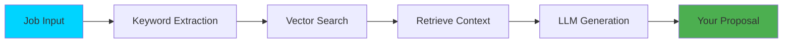

# 🚀 Quick Start Guide

**Start generating AI-powered proposals in 3 simple steps**

---

## 🎯 3-Step Workflow

The Auto-Bidder platform reduces proposal writing time from **30 minutes to 2 minutes** through a streamlined workflow:

### Step 1: Upload Your Knowledge Base 📚

**Goal:** Give the AI context about your skills, past projects, and expertise.

1. Navigate to **Knowledge Base** in the sidebar (⭐ start here)
2. Upload your portfolio documents:
   - Case studies (PDF, DOCX, TXT)
   - Project documentation
   - Team profiles
   - Client testimonials
   - Technical specifications
3. The system will automatically:
   - Extract text from your documents
   - Generate vector embeddings
   - Store them in ChromaDB for semantic search

**Why this matters:** The AI uses RAG (Retrieval-Augmented Generation) to pull relevant evidence from your uploaded documents when generating proposals. This ensures your proposals aren't generic but backed by real project examples.

---

### Step 2: Configure Your Strategy 🎯

**Goal:** Define how you want the AI to write your proposals.

1. Go to **Strategies** in the sidebar
2. Create or select a bidding strategy template:
   - **Professional/Corporate**: Formal tone for enterprise clients
   - **Casual/Friendly**: Conversational style for startups
   - **Technical**: Deep technical details for developer roles
   - **Custom**: Define your own prompt template
3. Set parameters:
   - Tone and voice preferences
   - Length guidelines (conservative/standard/aggressive)
   - Key selling points to emphasize

**Pro Tip:** Create multiple strategies for different types of projects (e.g., "Short-term Contract" vs "Long-term Partnership").

---

### Step 3: Generate Your Proposal 📝

**Goal:** Create a customized, evidence-based proposal in under 60 seconds.

1. Navigate to **Proposals** in the sidebar
2. Click "New Proposal" or paste a job posting URL
3. Fill in the form:
   - **Job Title**: e.g., "Full-Stack Developer for SaaS Platform"
   - **Job Description**: Copy-paste the full requirements
   - **Platform**: Upwork, Freelancer, Fiverr, etc.
   - **Budget**: Your proposed rate
   - **Timeline**: Estimated delivery time
4. Select your bidding strategy
5. Click **Generate AI Proposal**
6. The AI will:
   - Extract keywords from the job description
   - Search your knowledge base for relevant projects
   - Construct an optimized prompt
   - Generate a tailored proposal with citations
7. Review, edit, and finalize
8. Export to PDF/DOCX or copy to clipboard

**What happens behind the scenes:**

---

## 🧭 Navigation Options

Your dashboard sidebar provides access to all platform features:

### 📊 Dashboard
**What it is:** Your command center  
**What you'll see:**
- Overview of active proposals
- Recent activity timeline
- Quick stats (win rate, time saved, proposals sent)
- Shortcuts to common actions

**When to use it:** Starting point after login to see your progress at a glance.

---

### 💼 Projects
**What it is:** Job tracking and management  
**What you'll see:**
- Jobs you're currently bidding on
- Status tracking (draft, submitted, won, lost)
- Platform-specific details (Upwork, Freelancer, etc.)
- Budget and timeline information

**When to use it:** 
- Track multiple job applications
- Monitor proposal status
- Organize opportunities by platform or niche

---

### 📝 Proposals
**What it is:** AI proposal generation and draft management  
**What you'll see:**
- Proposal editor with real-time AI generation
- Draft versioning and auto-save
- Conflict resolution (if editing from multiple devices)
- Export options (PDF, DOCX, Markdown)

**When to use it:** 
- Generate new proposals (your main workflow!)
- Edit and refine AI-generated drafts
- Manage proposal versions
- Copy final text to submit on job platforms

**Key Features:**
- **Streaming responses**: See the AI write in real-time
- **Context citations**: The AI shows which documents it referenced
- **Auto-save**: Never lose your work (saves every 3 seconds)

---

### 📚 Knowledge Base
**What it is:** Your portfolio document library  
**What you'll see:**
- Uploaded documents organized by type
- Document metadata (upload date, file size, word count)
- Vector embedding status
- Search and filter capabilities

**When to use it:**
- ⭐ **First-time setup**: Upload your portfolio before generating proposals
- Add new case studies after completing projects
- Update team member profiles
- Remove outdated content

**Supported Formats:**
- PDF documents
- Microsoft Word (.docx)
- Plain text (.txt)
- Markdown (.md)

**Best Practices:**
- Upload 5-10 high-quality case studies
- Include specific metrics and outcomes
- Keep documents focused (one project per document)
- Update regularly as you complete new projects

---

### 🎯 Strategies
**What it is:** AI prompt template management  
**What you'll see:**
- Pre-built strategy templates
- Custom strategy editor
- Parameters for tone, length, and focus
- Preview and testing tools

**When to use it:**
- Before your first proposal: Select a default strategy
- When targeting different client types
- To A/B test different proposal styles
- Fine-tune AI behavior for your brand voice

**Strategy Components:**
- **System Prompt**: Core instructions for the AI
- **Tone Settings**: Formal, casual, technical, etc.
- **Length**: Conservative (~300), standard (~500), aggressive (~800+ words)
- **Focus Areas**: What to emphasize (speed, quality, cost, etc.)

---

### 🔑 Keywords
**What it is:** Smart job filtering based on your expertise  
**What you'll see:**
- Your skill keywords and technologies
- Job matching criteria
- Exclusion filters (to avoid irrelevant jobs)
- Keyword performance analytics

**When to use it:**
- Filter job boards efficiently
- Define your niche and specializations
- Avoid time-wasting on irrelevant postings
- Track which keywords lead to wins

**Example Keywords:**
- Technologies: `React`, `Node.js`, `PostgreSQL`, `AWS`
- Services: `Full-Stack Development`, `API Integration`, `DevOps`
- Industries: `FinTech`, `Healthcare`, `E-commerce`

---

### 📈 Analytics
**What it is:** Performance tracking and insights  
**What you'll see:**
- Win rate percentage
- Time saved (compared to manual proposal writing)
- Platform-specific performance (Upwork vs Freelancer)
- Proposal effectiveness over time
- Revenue tracking

**When to use it:**
- Weekly review of your bidding performance
- Identify which strategies work best
- Compare platform ROI
- Track time savings and efficiency gains

**Key Metrics:**
- **Win Rate**: Proposals sent vs. jobs won
- **Response Rate**: Client replies to your proposals
- **Average Time to Draft**: Typically under 2 minutes with AI
- **Manual Baseline**: 30 minutes per proposal (90%+ time savings)

---

### ⚙️ Settings
**What it is:** Account and application preferences  
**What you'll see:**
- Profile information
- API key management (OpenAI, DeepSeek)
- Default preferences (language, timezone)
- Theme settings (light/dark mode)
- Notification preferences

**When to use it:**
- Initial account setup
- Update API credentials
- Customize your experience
- Manage subscription (future feature)

---

## 🔄 Typical User Flow

Here's how most users interact with the platform daily:

1. **Morning**: Check **Dashboard** for new opportunities and responses
2. **Browse Jobs**: Use **Keywords** filters on Upwork/Freelancer
3. **Generate Proposals**: 
   - Input job details in **Proposals**
   - AI generates draft in 30-60 seconds
   - Review and tweak
   - Submit on job platform
4. **Track Progress**: Update status in **Projects**
5. **Weekly Review**: Check **Analytics** to optimize strategy
6. **Continuous Improvement**: Add new case studies to **Knowledge Base** after completing projects

---

## 💡 Pro Tips

### For Best Results:

1. **Start with quality knowledge base content**  
   Upload 5-10 detailed case studies before generating your first proposal. The AI is only as good as the context you provide.

2. **Create project-specific strategies**  
   Don't use the same strategy for enterprise clients and startup gigs. Tone matters!

3. **Review and personalize**  
   The AI generates 90% of the work, but always add a personal touch. Mention something specific from the job posting.

4. **Track what works**  
   Use Analytics to identify winning patterns. If casual proposals work better for you, lean into that strategy.

5. **Keep your knowledge base fresh**  
   Update it monthly with new projects, testimonials, and skills.

### Common Pitfall to Avoid:

❌ **Don't skip the Knowledge Base step**  
Without uploaded documents, the AI generates generic proposals. The magic happens when it can cite your real projects.

---

## 🆘 Need Help?

- 📖 **Full Documentation**: See `/docs` folder for detailed guides
- 🏗️ **Architecture**: [ARCHITECTURE_DIAGRAM.md](./2-architecture/ARCHITECTURE_DIAGRAM.md)
- 🔧 **Implementation Details**: [IMPLEMENTATION_STRATEGY.md](./3-guides/IMPLEMENTATION_STRATEGY.md)
- 🚀 **Deployment**: [PRODUCTION_DEPLOYMENT.md](./3-guides/PRODUCTION_DEPLOYMENT.md)

---

## 🎉 You're Ready!

Follow the 3-step workflow, explore the navigation options, and start generating winning proposals in minutes instead of hours. Happy bidding! 🚀
